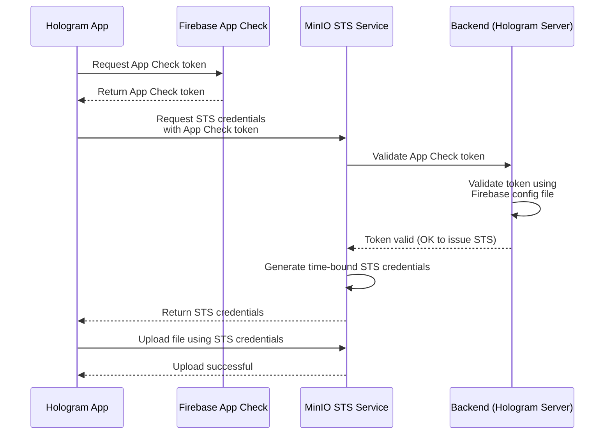

# Hologram Server

Mobile app authentication service providing temporary MinIO STS credentials through Firebase App Check validation.

## Overview

Hologram Server authenticates legitimate mobile applications via Firebase and delivers temporary credentials to interact with MinIO. This eliminates the need for an additional App Check service and maintains control over file uploads through time-bound credentials.

## Features

- Firebase App Check validation for mobile app authentication
- Temporary STS credentials generation with controlled validity period
- Fine-grained access control per session
- Direct upload capability to MinIO without backend mediation

## Installation

### Requirements

- Node.js 18+
- pnpm 9+

### Setup

```bash
git clone git@github.com:2060-io/hologram-server.git
cd hologram-server
pnpm install
cp .env.example .env
pnpm start:dev
```

## Environment Variables
| Variable             | Default Value                      | Description                                                                                                  |
| -------------------- | ---------------------------------- | ------------------------------------------------------------------------------------------------------------ |
| `appPort`            | `3000`                             | Port where the application runs. It reads from `AGENT_PORT`; if not set, it defaults to `3000`.              |
| `bucketServer`       | `https://p2800.ovpndev.mobiera.io` | Storage server (MinIO / bucket) URL where STS credentials are requested.                                     |
| `bucketRegion`       | `us-east-1`                        | Bucket region used when generating STS credentials.                                                          |
| `firebaseCfgFile`    | `./tests/test-firebase-cfg.json`   | Path to the Firebase configuration/service account file used by the backend to validate the App Check token. |
| `maxValiditySeconds` | `900`                              | Maximum validity time (in seconds) for the generated STS credentials.                                        |


## Architecture

### Authentication Flow



### Benefits

- Integrated authentication without additional services
- Short-lived credentials enhance security
- Backend doesn't mediate file transfers
- Granular control per upload session
